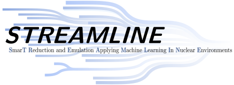

# Greedy Emulators for Nuclear Two-Body Scattering

<p>
The STREAMLINE members at Ohio U and OSU have developed an active learning approach to snapshot selection that allows for the construction of fast & accurate emulators for two-body scattering. 
  
This repository accompanies our [manuscript](https://arxiv.org/abs/2504.06092) (Phys. Rev. C in press).

An independent implementation of the greedy algorithm can be found in [this](https://github.com/buqeye/cs_greedy_emulator_josh) repository, which creates 
* [Figure 1](https://github.com/buqeye/cs_greedy_emulator_josh/blob/main/greedy-vs-pod-figure-image-generation.ipynb) (illustration of the POD vs greedy algorithm) and
* [Figure 11](https://github.com/buqeye/cs_greedy_emulator_josh/blob/main/kohn_anomaly_visualization.ipynb) (illustration of Kohn anomaly removal).

All other figures were created using this repository.

**At a glance:**   
* Numerov method in matrix form (FOM solver)
* Galerkin reduced order model (ROM) based on the Numerov method
* Proper Orthogonalization (POD)
* efficient offline-online decomposition
* error estimates and greedy algorithm for snapshot selection

The two developed emulators are based on the Petrov-Galerkin Reduced Basis Method (RBM). They implement a **greedy approach** to refine their basis iteratively in the training stage, placing snapshots in the interaction’s parameter space where the emulator’s error is estimated to be maximum.  This algorithm implements the estimation of emulator errors, which is still in its infancy in nuclear physics, and has a wide range of applications for emulating solutions of large linear systems. 
This algorithm is contrasted with a **Proper Orthogonalization Decomposition (POD)**.

## Overview

The repository is organized as follows:

* `data`: contains the values of the low-energy couplings associated with the GT+ potentials as `yaml` files. The file names encode the chiral order, regulator cutoff, and spectral function cutoff. The values were extracted from the developer's source code. 
* `logos`: contains the logos relevant to this work
* `modules`: contains classes, functions, and more relevant to our emulators.
* `plots`: contains code for plotting
* `pdf`: contains the figures generated in the PDF format
* `src`: contains `C++` code associated with the GT+ potentials. The codes were modified from their original version, which was kindly provided by I. Tews. Attempt was made to keep the modifications minimal. **Affine versions** of the potentials have been added.
  
The following `Jupyter` notebooks are included, providing the key results of this work:

* `notes.ipynb`: contains notes useful for implementing the emulator equations.
* `chiral.ipynb`: produces all figures pertinent to the GT+ chiral potentials.
* `minnesota.ipynb`: produces all figures pertinent to the simple Minnesota potential.
* `SCM_playground.ipynb`: contains our explorations of the Successive Constraint Method (SCM).
  
The LEC files in `data` can be generated via:
```shell
make lec_output
./lec_output
```
This will also run a unittest that checks whether the function returning the affine decomposition of the chiral interactions matches the output of the original function provided by the developers (i.e., not based on the affine decomposition).

We thank Ingo Tews for allowing us to provide this repository with the (modified) source code that evaluates the local [Gezerlis, Tews et al.](https://inspirehep.net/literature/1298829) chiral interactions.

## Installing and testing the Python code

Install requirements by running:
```shell
python3 -m venv .venv
source .venv/bin/activate
python3 -m pip install -r requirements.txt
# deactivate ## when the job is done
```
One could also manually install (recent versions of) the required `Python` packages via:
```shell
python3 -m pip install numpy scipy pandas seaborn jupyter matplotlib cython pyyaml
```
Further, `Cython`, `gcc`, and `GSL` need to be installed for the chiral interactions. On MacOS, `gcc` and `GSL` can be installed using HomeBrew:
```shell
brew install gcc gsl
```

In addition, [Johnson's cubature](https://github.com/stevengj/cubature) library needs to be built and installed. This can, e.g., be done via:

```shell
make install_cubature CXX=g++-14
# make sure to add the printed line to your shell's rc file
```

The location of this installation will be `~/src/cubature`.

Compile the local chiral interactions GT+ ([external C++ code](src/localGt+.cpp) provided by the developers):
```shell
make clean
make CXX=g++-14 # make sure to use the GNU c++ compiler, not clang
```

The chiral interactions can also be compiled manually. This is, however, not needed.
```shell
g++ -fPIC -O3 -shared -c src/localGt+.cpp -o liblocalGt+.so -I/usr/local/include -I./src/
python3 setup.py build_ext --inplace
```

Run a test calculation for the general KVP (can be skipped if only the new Galerkin emulator is of interest):

```shell
make test  # run predefined test calculation
python3 main.py -rm 25 -p chiral -er 0.01 40. 60 -lmax 4  # with some variables specified, for example
```

For more help run:
```shell
python3 main.py --help
```
Run the following pytest command to test important components of the code:

```python
python3 -m pytest tests.py
```

## Cite this work

Please use the following BibTeX entry to cite our work:

```bibtex
@article{Maldonado:2025ftg,
    author = "Maldonado, J. M. and Drischler, C. and Furnstahl, R. J. and Mlinari{\'c}, P.",
    title = "{Greedy Emulators for Nuclear Two-Body Scattering}",
    eprint = "2504.06092",
    archivePrefix = "arXiv",
    primaryClass = "nucl-th",
    month = "4",
    year = "2025"
}
```

## Contact details

Christian Drischler (<drischler@ohio.edu>)  
Department of Physics and Astronomy   
Ohio University  
Athens, OH 45701, USA 
